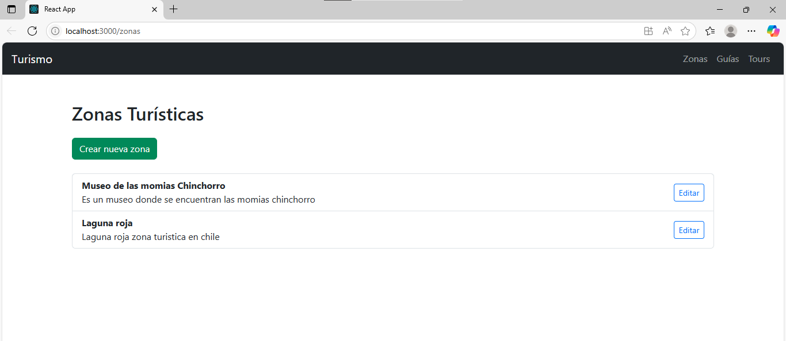
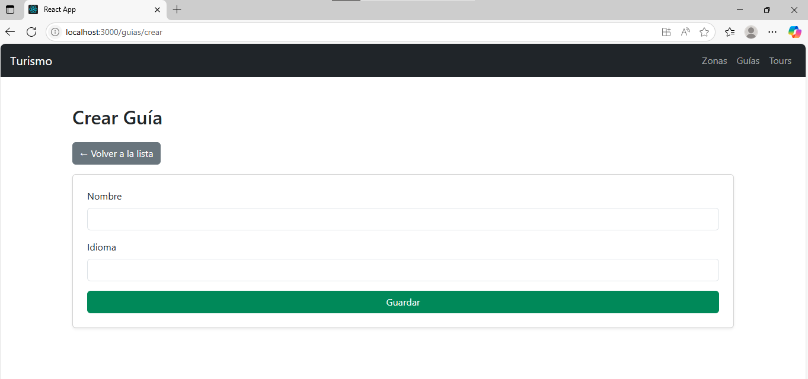
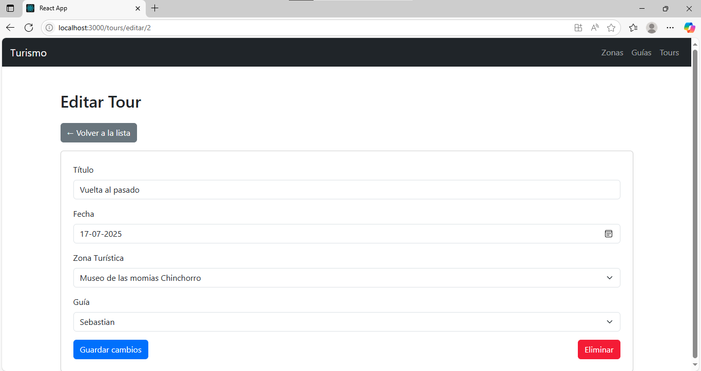
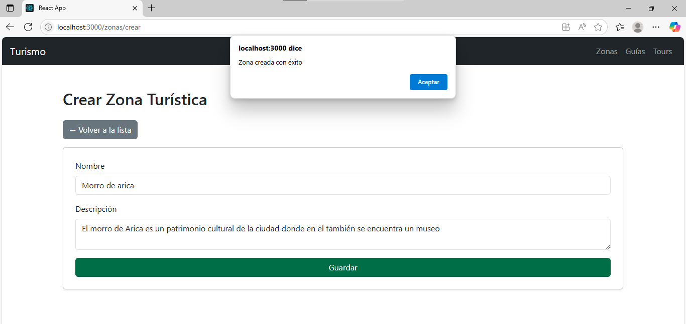
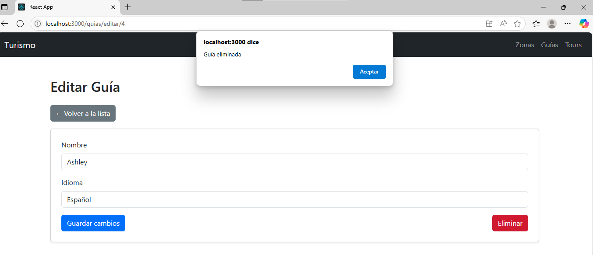
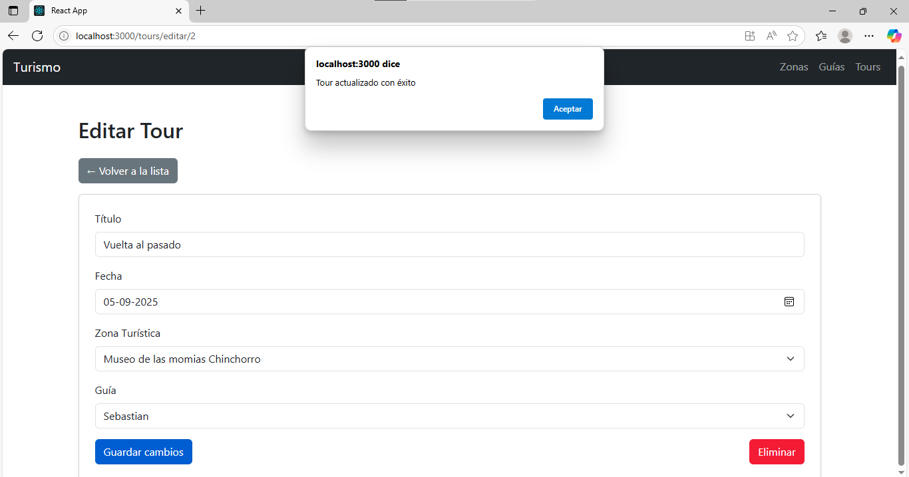

# Evaluación Sumativa – Registro de Actividades Turísticas y Guías
El sistema de Registro de Actividades Turísticas y Guías es una aplicación web diseñada para gestionar de forma centralizada la información relacionada con zonas turísticas, guías y tours.
Permite a los administradores registrar, visualizar, editar y eliminar datos sobre lugares turísticos, los guías que trabajan en cada recorrido y los tours programados. Está orientado a facilitar la organización de actividades turísticas en una comunidad o región, ofreciendo una interfaz moderna y responsiva desarrollada con Django REST (backend) y React (frontend).
## Tecnologías utilizadas
Backend – Django
- Django 4+
- Django REST Framework
- Python 3.11
Modelos en backend:
- `ZonaTuristica`
- `Guia`
- `Tour`
Preparado para escalar con:
- `Comentario`
- `Reserva`
- `Usuario
---
Frontend – React
- React con `create-react-app`
- Axios para llamadas a la API
- React Router DOM para navegación
- Bootstrap 5 para estilos visuales

# Las funcionalidades que tiene
CRUD completo para:
- Zonas Turísticas  
- Guías  
- Tours

Cada entidad cuenta con:
- Página para listar
- Formulario para crear
- Formulario para editar
- Botón para eliminar

Todos los formularios están validados visualmente y estilizados con Bootstrap.

# Diagrama de los modelos y sus relaciones
  ZonaTuristica             Guia
   -------------           ------------
   id (PK)                id (PK)
   nombre                 nombre
   descripcion            idioma
        ▲                     ▲
        │                     │
        │                     │
        └────────────┬────────┘
                     │
                  ▼ Tour
             --------------------
             id (PK)
             titulo
             fecha
             zona_id (FK → ZonaTuristica)
             guia_id (FK → Guia)

- Un Tour pertenece a una Zona Turística
(ForeignKey zona → muchos tours pueden estar en una misma zona)
- Un Tour es guiado por un Guía
(ForeignKey guia → muchos tours pueden estar a cargo de un mismo guía)

Es una relación muchos-a-uno tanto desde Tour → Zona, como Tour → Guía.

# Capturas de pantalla del frontend funcionand
### listado de Zonas Turisticas

### Crear guia

### Editar tour

### Zona creada

### Eliminar guia

### Actualizar tour

# instrucciones para ejecutar el backend - frontend
BACKEND – Django (API)
Ubicación:
/registros (o la carpeta donde está manage.py)

Pasos:
Abrir terminal en la raíz del proyecto:
cd registro_actividades_turisticas_y_guias

Instalar dependencias del backend:
pip install -r requirements.txt

Aplicar migraciones:
python manage.py makemigrations
python manage.py migrate

Levantar el servidor de desarrollo:
python manage.py runserver

Acceder a la API en el navegador:
http://localhost:8000/api/

FRONTEND – React (interfaz web)
Ubicación:
/frontend_turismo

Pasos:
Entrar a la carpeta del frontend:
cd frontend_turismo

Instalar dependencias (una vez):
npm install

Iniciar el servidor React:
npm start

Acceder a la interfaz web:
http://localhost:3000

El backend debe estar corriendo antes de levantar el frontend
